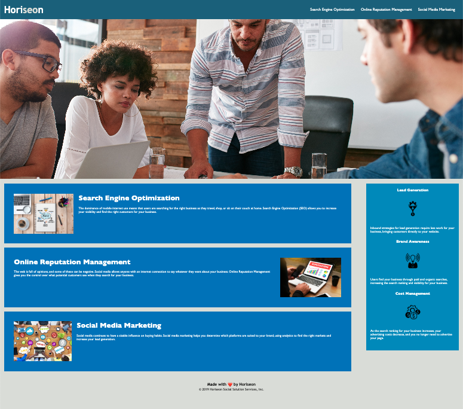

# Challenge-1
# <Horiseon Marketing Agency>

## Description
At Horiseon Marketing Agency,
we provide amazing marketing resources for all business owners. 
We want all of our customers to find exactly what they are looking for, and tell us what they need, so that as a team, we can fullfil their business goals. 

## Acceptance Criteria
GIVEN a webpage meets accessibility standards
WHEN I view the source code
THEN I find semantic HTML elements
WHEN I view the structure of the HTML elements
THEN I find that the elements follow a logical structure independent of styling and positioning
WHEN I view the image elements
THEN I find accessible alt attributes
WHEN I view the heading attributes
THEN they fall in sequential order
WHEN I view the title element
THEN I find a concise, descriptive title

## Table of Contents
Search Engine Optimization
Online Reputation Management
Social Media Marketing

## Deployment
https://yaneyalvarado.github.io/Challenge-1/

## GitHub
https://github.com/yaneyalvarado/Challenge-1

## Mock-up
